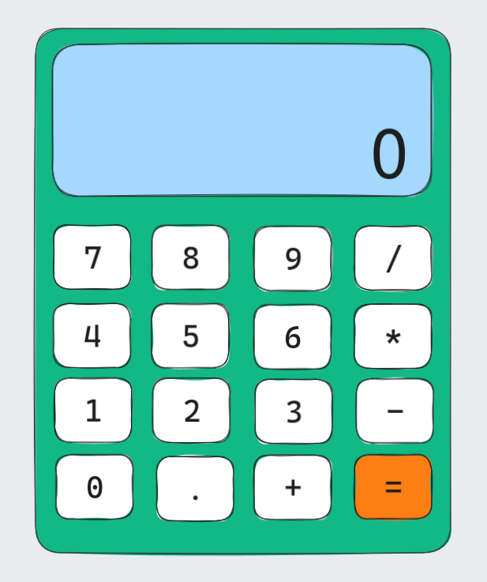

# calculator

An on-screen calculator using JavaScript, HTML, and CSS.

### Design sketch:

### Current bugs:

- [x] Pressing '=' before entering all of the numbers or an operator could cause problems!
- [x] Display a snarky error message if the user tries to divide by 0… and don’t let it crash your calculator!
- [ ] Round answers with long decimals so that they don’t overflow the screen.
- [ ] When user enters one more operator after second operand, we should calculate first expression and than place the result as a first operand of the new expression with this operator.
- [ ] When user enters number for the first time - delete leading zero.
- [ ] Prevent user from entering two decimal points in one operand.
- [ ] When user clears single character we should check if we delete operator character to give possibility to the user to enter new operator again.
- [x] Add modulus division operator support.
