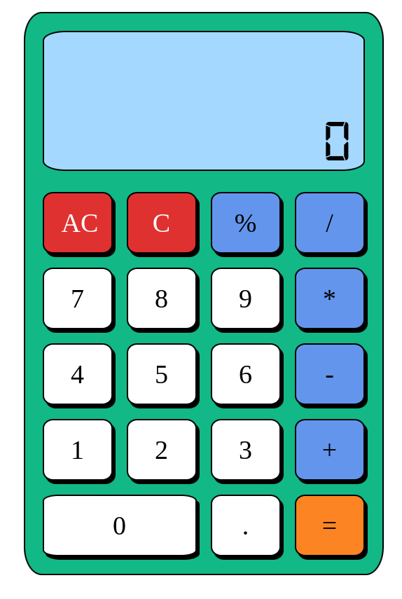

# calculator

An on-screen calculator using JavaScript, HTML, and CSS.
 Final project of the ODIN Foundations course POGGIES :)

### Design:

### TODO:

- [x] Pressing '=' before entering all of the numbers or an operator could cause problems!
- [x] Display a snarky error message if the user tries to divide by 0… and don’t let it crash your calculator!
- [x] Round answers with long decimals so that they don’t overflow the screen.
- [x] When user enters one more operator after second operand, we should calculate first expression and than place the result as a first operand of the new expression with this operator.
- [x] When user enters number for the first time - delete leading zero.
- [x] Prevent user from entering two decimal points in one operand.
- [x] When user clears single character we should check if we delete operator character to give possibility to the user to enter new operator again.
- [x] Add modulus division operator support.
- [x] Add keyboard support

### Tech Stack:

- HTML/CSS
- JS (DOM API)

### Challenges faced:

- One challenge was to think how do I add keyboard support with less amount of effort. Initially I thought about separate functions that would handle key event, like I did with mouse, but that would led to some clutter code. So I came up with an idea of event dispatching. I just added data- attributes with the appropriate key value to be pressed.
  Searched the targeted key element with DOM API function call and than created my custom click event and dispatch it. I think that this code is pretty clean and readable.
- I found it hard to structure my code in a readable manner, especially some cryptic boolean expressions that checked for some edge case. I moved them to the separate functions to make code more readable, but still I think that my code is not good enough, mb it lacks some architecture considerations to separate all this functionality. Hopefully I will be able to replace this gibberish code after some time :)

### What did I learn from this project:

- This project had a lot of edge cases and potential bugs and I gained a lot of experience with identifying those problems. And I realized that this just a matter of practice.
- I learned that the premature optimization is evil by practice. Because I got deep into the rabbit hole thinking about an optimize way of doing thing. But I realized that sometimes you just need to get your job done and then if the app would have some performance issues you can consider some optimizations.
- Practiced some other unusual git commands for me like git diff and git stash and git checkout to move to some specific comment.
- Improved my design skills a little bit, before this project I was a total noob in this area.
- Learned a bit about some CSS pseudo classes.
